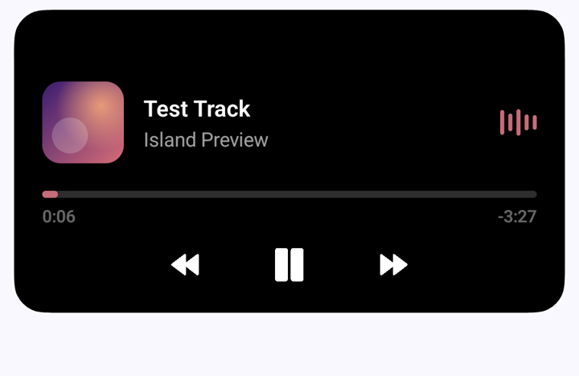
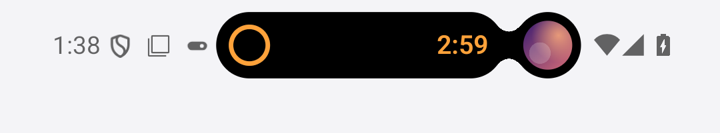
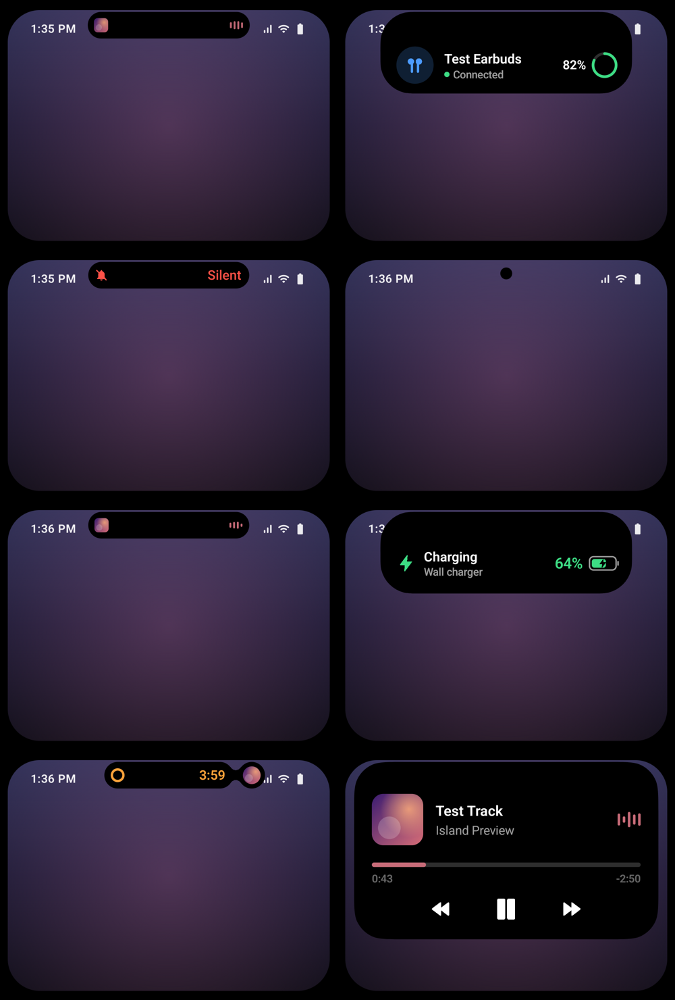
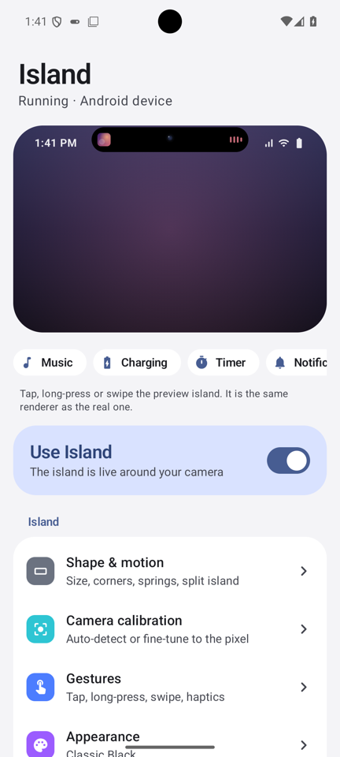
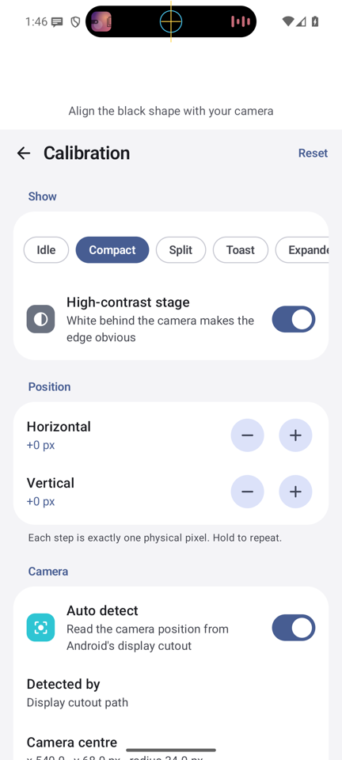
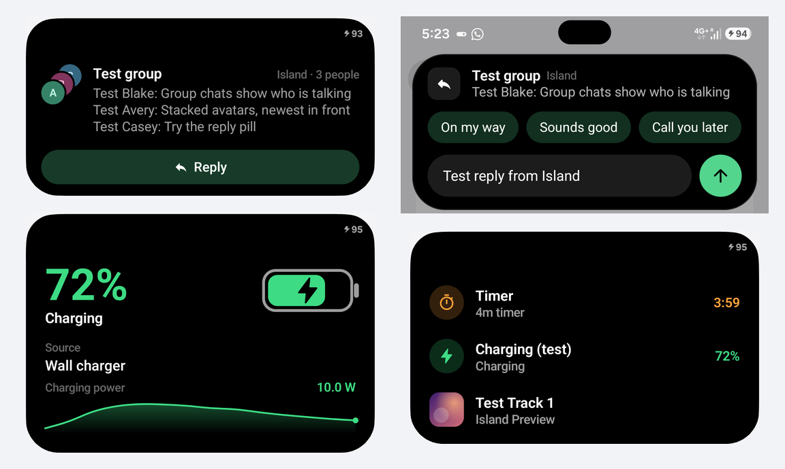

# Island

A Dynamic Island–style live activity system for Android, built for the **Samsung Galaxy S23+**
(and any phone with a centred punch-hole camera). Free, fully local, no root, no accessibility
service, no network permission.

<p>
  
  
</p>

Everything below the camera is drawn by one renderer: a black island that morphs, with closed-form
spring physics, between idle, compact, split, toast and expanded states. Any transition can be
interrupted mid-flight and keeps its velocity.

| Live preview (same renderer as the overlay) | Home | Calibration |
|---|---|---|
|  |  |  |

*Screenshots are from an Android 16 emulator with a punch-hole cutout, running this code.*

**New in 1.1**, on a real Galaxy S23+: group chats with quick reply, the charging graph and stack peek.



---

## Download

### [⬇ Download the latest APK](https://github.com/Arnav-Dugad/dynamic-island-android/releases/latest)

Works on **Android 11 or newer**, best on phones with a centred punch-hole camera (tuned for the
Galaxy S23+; other phones can calibrate it).

Each release has two files. They are the same app with the same signature, so either one installs
over the other and keeps your settings.

| File | Install from | What works |
|---|---|---|
| `Island-Lite-vX.Y.Z.apk` | A browser, easiest for friends | Charging, battery, Bluetooth, timers & stopwatch, system events, Glance, local API |
| `Island-vX.Y.Z.apk` | USB (`adb install -r`) | Everything, including music, calls, navigation, downloads and notifications |

1. On your phone, open the link above and download the APK you want from **Assets**.
2. Open the file. If asked, allow your browser or Files app to **install unknown apps**.
3. Play Protect may say the developer is unrecognised, because the app is not on the Play Store.
   Choose **Install anyway**. The app has no internet permission, so it cannot send data anywhere.
4. Open **Island** and follow the short setup. If notification access is greyed out, go to
   *Settings → Apps → Island → ⋮ → Allow restricted settings* and try again.

> **"App blocked to protect your device"?** On some phones Play Protect's *enhanced fraud
> protection* blocks browser installs of any app that asks for notification access. Install the
> Lite edition, or install the full edition over USB: enable *Developer options → USB debugging*,
> then run `adb install -r Island-vX.Y.Z.apk` on a computer. Island never tries to get around this.

**Updating:** install the newer APK over the old one; your settings are kept. *About → Check for
updates* opens the latest release, and *About → Automatic updates with Obtainium* adds Island to
[Obtainium](https://github.com/ImranR98/Obtainium), a free open-source app that watches GitHub
releases for you. Island itself never goes online.

**Sharing with friends:** *Share with friends* in the app shows a QR code for the download page and
a step-by-step install guide.

---

## Contents

- [Download](#download)
- [Features](#features)
- [Build and install](#build-and-install)
- [First run: permissions](#first-run-permissions)
- [Calibrating for the Galaxy S23+](#calibrating-for-the-galaxy-s23)
- [Testing every event](#testing-every-event)
- [Samsung battery optimisation](#samsung-battery-optimisation)
- [Known Android limitations](#known-android-limitations)
- [Local API for your own apps](#local-api-for-your-own-apps)
- [Architecture](#architecture)
- [Privacy](#privacy)
- [Tests and QA](#tests-and-qa)

---

## Features

**Island**
- Camera detection from Android's display cutout (precise cutout path on Android 12+), with 1‑px
  manual fine tuning, a manual camera override and a Galaxy S23+ (`SM-S916*`) device profile.
- States: hidden, idle (camera disc / tiny pill / hidden), compact live activity, split island
  (pill + liquid "bud"), temporary toast, expanded interaction card.
- Motion engine: analytic damped springs (frame-rate independent, interruptible, velocity
  preserving), width-leads-height expansion and height-leads-width collapse, content revealed
  only once the shape can hold it, continuous-corner ("squircle") shapes that stay concentric with
  the display's own rounded corners, metaball split transitions.
- Presets Natural, Snappy, Soft, Elastic and Custom (speed, intensity, stiffness, damping).
- Gestures: tap, long-press, swipe up/down/sideways, press compression biased toward the touched
  edge, rubber-band drag deformation, haptics, seek-bar scrubbing.
- Themes: Classic Black (default), Glass, Minimal, Samsung (wallpaper accent), RGB Gaming.
- Expressive motion (each effect can be switched off): icon flight from the status bar, album
  art that glides between pill and card, squash & stretch driven by the spring's own velocity,
  speed-reactive corners, magnetic drag detents, throw-to-dismiss, odometer digits, arrival pulse,
  lens glint, blur-in text (Android 12+), tilt depth, haptic primitives and optional sound design.
- Glance (long-press the empty island) and Stack peek (pull an open card further down to see
  every running activity).

**Activities**
| Source | What you get |
|---|---|
| Media | Any MediaSession player (Spotify, YouTube Music, Samsung Music, Apple Music, Poweramp, VLC…): artwork, artwork-tinted equalizer and glow, progress, seek, previous/play/pause/next, play↔pause morph, up next, output device, volume |
| Notifications | Banners or compact pill, merged per conversation, stacked avatars for group chats, quick reply through the app's own reply action, actions, per-app accent colours, per-app rules, privacy levels |
| Calls | Incoming (auto-expands) and ongoing calls; answer/decline/hang up when the dialer provides them |
| Charging | Five themes (Minimal, Energy, Liquid, Pulse, One UI), counting percentage, time to full, temperature, live charging-power graph, "Paused at 85%" |
| Battery | Low battery, fully charged, Power saving on/off |
| Bluetooth | Earbuds, headphones, speakers, watches, cars with an arrival animation and reported battery |
| Timers & stopwatch | Local timers that survive process death and reboots, +1 min, laps, final ten-second countdown |
| Navigation | Distance, instruction and maneuver icon from navigation notifications (pluggable providers) |
| Progress | Downloads and anything reporting progress, with a completion check animation |
| System | Silent/vibrate/ring, Do Not Disturb, wired headset, rotation lock, hotspot*, screen recording (Android 15+), clipboard* |
| Monitor | Opt-in RAM, network speed, CPU clock, temperature, island FPS |
| Local API | Your own apps post activities with `IslandClient.show(...)` |

\* best effort / off by default, see limitations.

**Settings app**: Material 3, dark/light/AMOLED, live preview on the home screen, onboarding,
calibration, Island Studio (drag the real island's edges), Motion lab (spring curves), animated
theme gallery, per-app rules and colours, What's new (plays each feature on the preview), share
page with QR code, experimental status bar cleanup, developer test panel, debug HUD.

---

## Build and install

### Requirements
- A recent **Android Studio** that supports Android Gradle Plugin 9.4 (it bundles a suitable JDK), or any JDK 17+ for command-line builds.
- Android SDK Platform **37** (compileSdk) and Build-Tools 36+. Android Studio installs these on sync.
- The build is fully offline-capable once dependencies are cached. No API keys, accounts or services.

### Open the project
1. `File → Open…` and select this folder (the one containing `settings.gradle.kts`).
2. Let Gradle sync. The Gradle daemon provisions JDK 25 automatically (`gradle/gradle-daemon-jvm.properties`).

### Build from the command line
There are two product flavors: `full` and `lite` (no notification listener, see [Download](#download)).

```bash
# macOS / Linux / Git Bash
./gradlew assembleFullDebug                        # debug APK
./gradlew assembleFullRelease assembleLiteRelease  # R8-optimised release APKs (~3 MB each)
./gradlew testFullDebugUnitTest                    # unit tests
```
```bat
:: Windows (cmd / PowerShell)
gradlew.bat assembleFullDebug
gradlew.bat assembleFullRelease assembleLiteRelease
```

### Where the APK is
| Build | Path |
|---|---|
| Debug | `app/build/outputs/apk/full/debug/app-full-debug.apk` |
| Release | `app/build/outputs/apk/full/release/app-full-release.apk` |
| Lite release | `app/build/outputs/apk/lite/release/app-lite-release.apk` |

The release build is signed with your local debug key unless you add a `keystore.properties` at
the project root (`storeFile`, `storePassword`, `keyAlias`, `keyPassword`), so it is installable
either way. Every build shares one application id (`com.arnav.island`).

### Releases
Pushing a `v*` tag runs [`.github/workflows/release.yml`](.github/workflows/release.yml): it runs
the unit tests, builds both editions, checks that they are signed with the release certificate,
and publishes them with `SHA256SUMS.txt` and the notes from `docs/releases/<tag>.md`. The key
comes from four encrypted repository secrets (`SIGNING_KEYSTORE_BASE64`, `SIGNING_STORE_PASSWORD`,
`SIGNING_KEY_ALIAS`, `SIGNING_KEY_PASSWORD`). Every push and pull request is built and tested by
[`ci.yml`](.github/workflows/ci.yml).

### Install
- **USB:** enable *Developer options → USB debugging*, then `adb install -r app/build/outputs/apk/full/release/app-full-release.apk`.
- **Android Studio:** press **Run**.
- **Manually:** copy the APK to the phone and open it (allow "Install unknown apps" for your file manager).

---

## First run: permissions

The onboarding walks through each one and explains why it is needed. Only the first is required.

| Permission | Why | Required |
|---|---|---|
| **Display over other apps** | Drawing the island at all | Yes |
| **Notification access** | Media sessions, calls, navigation, downloads, notifications | For those features |
| Notifications (Android 13+) | "Timer finished" alert sound | Optional |
| Nearby devices | Bluetooth device name/type/battery | Only if Bluetooth events are on |
| Usage access | Per-app rules and Game Mode (which app is in front) | Optional |
| Alarms & reminders | Second-accurate timer completion in deep sleep | Optional |
| Modify secure settings | Status bar cleanup only; granted over ADB, never requested in the app | Optional, experimental |

Island never asks for contacts, SMS, location, microphone or camera, and has **no INTERNET permission**.

### Status bar cleanup (experimental)
*Island → Advanced → Status bar cleanup* hides status bar icons the island already shows (alarm,
sound mode, Do Not Disturb, rotation lock…) through Android's `icon_blacklist` setting, the one
System UI Tuner uses. It needs a one-time grant from a computer:

```bash
adb shell pm grant com.arnav.island android.permission.WRITE_SECURE_SETTINGS
```

Your previous value is saved and restored when you turn it off. Turn it off before uninstalling;
if you forget, `adb shell settings delete secure icon_blacklist` brings every icon back.

### Enable the overlay
*Island → Use Island*, or *Settings → Apps → Island → Appear on top → Allow*.

### Enable notification access
*Island → Media/Notifications → Grant access*, or
*Settings → Notifications → Device & app notifications (Notification access) → Island*.

> **"Restricted setting" / greyed-out toggle?** Android 13+ blocks notification access for apps
> installed outside an app store until you allow it: *Settings → Apps → Island → ⋮ (top right) →
> Allow restricted settings*, then grant access again. Onboarding has a shortcut.

---

## Calibrating for the Galaxy S23+

Island reads the camera position from Android at runtime, so on an S23+ it should line up
out of the box. To fine tune:

1. Open **Island → Camera calibration**. Calibration keeps the island visible over a white
   "stage" so the edge is obvious, and draws guides on the real island: a **cyan circle** is the
   camera Android reported and a **yellow crosshair** is the island's anchor.
2. Use **Horizontal / Vertical** `−` `+` to move the anchor by exactly one physical pixel
   (hold to repeat).
3. Pick **Show: Compact / Split / Toast / Expanded** to check every shape against the camera.
4. **Camera padding** controls how much black surrounds the lens in the idle state; **Compact
   width/height**, **Expanded max width** and **Corner roundness** are live.
5. If a device reports no cutout, turn off **Auto detect** and set *Camera X / Y / radius* manually.
   **Reset** restores automatic detection.

The detection details (source, camera centre, cutout size, display, status bar height) are shown
on the same screen. The **Debug HUD** (Advanced) shows them live over any app.

**Tips for the cleanest look on One UI**
- *Settings → Notifications → Status bar → Show notification icons:* **3 most recent** or **None**,
  so fewer status icons sit beside the camera (see limitations).
- The ongoing "Island is active" notification can be hidden: *Settings → Apps → Island →
  Notifications → Island service → off*. The island keeps running.

---

## Testing every event

**Island → Developer tools** fires every event on the real overlay:
music, charging (current theme), notification (merges on repeat), Bluetooth, a **real** one-minute
timer, stopwatch, call-style UI, download progress, split island, ringer and a custom activity,
plus Expand/Collapse and Clear. New in 1.1: group chat with quick reply (the reply goes nowhere),
timer final countdown, charging graph, Glance (real device state), stack peek and the reply sheet.
The home-screen preview and *What's new* do the same inside the app.

Real sources, to confirm end to end:
| Event | How to trigger |
|---|---|
| Media | Play something in Spotify / YouTube Music / Samsung Music |
| Notification | Send yourself a message, or `adb shell cmd notification post -t "Title" tag "Body"` |
| Charging | Plug in a charger (wireless too) |
| Low battery | Happens below your threshold (Battery settings); Power saving toggles also announce |
| Bluetooth | Connect earbuds/headphones/watch (grant Nearby devices first) |
| Timer | Timers screen → Start. Finishes with an alarm sound even with Island closed |
| Call | Receive a call |
| Navigation | Start Google Maps navigation |
| Progress | Download a file in Chrome, or update apps in the Play Store |
| Ringer / DND | Volume keys → silent/vibrate, or Quick Settings → Do Not Disturb |
| Screen recording | Android 15+: start the screen recorder |

Gestures: **tap** opens the app (or expands, per Gestures settings), **long-press** or **swipe down**
expands, keep pulling down (or pull an open card) for **stack peek**, **long-press the empty island**
for Glance, **swipe up** collapses, **fling sideways** throws the island away (and clears the
notification where Android allows), tap outside collapses.

---

## Samsung battery optimisation

One UI aggressively sleeps background apps. For a reliable island:

1. *Settings → Apps → Island → Battery →* **Unrestricted**.
2. *Settings → Battery → Background usage limits →* make sure Island is **not** in *Sleeping* or
   *Deep sleeping apps* (add it to *Never sleeping apps*).
3. Keep **Start on boot** on (Island → Advanced).

Why it matters: Island runs a minimal foreground service (required by Android for a persistent
overlay). Android 12+ only lets it restart itself in the background (after updates or process
death) if the app is exempt from battery optimisation. An idle island draws nothing and uses no
CPU; animations run only while something moves.

---

## Known Android limitations

Island only uses public APIs and never works around a platform protection. Where Android says no,
it uses the best legitimate fallback:

- **Status bar above overlays.** Without an accessibility service (deliberately not used),
  app overlays sit *below* SystemUI's status bar window. Consequences:
  - Status bar icons can draw on top of a wide island.
  - Touches directly beside the camera go to the status bar. Island adds a **touch strip just
    below the status bar** (Gestures → Touch area) in compact states. Expanded cards and toasts
    below the status bar are fully interactive, and in fullscreen apps the whole pill is touchable.
  - Expanded cards keep their content below the status-bar band.
- **Lock screen / AOD:** overlays cannot draw there; the island hides while locked and returns on unlock.
- **Apps that block overlays** (system Settings, banking, some video apps) hide the island. This is
  enforced by Android and respected.
- **Audio visualisation:** the equalizer is decorative. Real audio levels would need the
  microphone permission, which Island refuses to ask for.
- **Charging speed:** Android has no public "fast charging" flag. Island labels *Fast* only when
  the public current × voltage readings sustain ≥12 W (≥22 W for *Super fast*), otherwise just
  *Charging*. Time-to-full is shown only when Android estimates it.
- **Calls:** answer/decline/hang up appear only when the dialer's notification exposes them
  (CallStyle or labelled actions). No private telephony APIs are used.
- **Navigation:** limited to what navigation apps publish in their notification.
- **Bluetooth battery** is shown only when the device reports it to Android.
- **CPU usage** system-wide is not readable by apps since Android 8; the monitor shows CPU clock instead.
- **Hotspot** state is not public API; the event appears only if the platform broadcasts it.
- **Clipboard:** Android 10+ reports copies only while Island is in the foreground; content is never read.
- **Screen recording** detection uses the Android 15 API; unavailable on older versions.
- **Glass theme:** an overlay window cannot blur what is behind an animated shape, so Glass is
  translucent smoked glass with a highlight and hairline rim, and the lens area stays true black.
- **Foreground service icon:** Android always shows a (hideable) notification for the service.
- **Quick reply** appears only when the app's notification offers a free-form reply action; the
  text is delivered through that action exactly as the notification shade would send it.
- **Output device** is the highest-priority connected output (Bluetooth, then wired, then the
  phone), which is where Android routes media. Per-app audio routing is not visible to apps.
- **Notification access and Play Protect:** see [Download](#download) for why the full edition may
  need a USB install.

---

## Local API for your own apps

Copy [`client/IslandClient.kt`](client/IslandClient.kt) into your app, then:

```xml
<!-- your app's AndroidManifest.xml -->
<uses-permission android:name="com.arnav.island.permission.POST_ISLAND_ACTIVITY" />
<queries><package android:name="com.arnav.island" /></queries>
```

```kotlin
// Request the permission once (it is a runtime permission the user approves), then:
IslandClient.show(context, id = "build", title = "Building…", subtitle = "assembleRelease",
    icon = "DOWNLOAD", progress = 0.4f)                 // persistent live activity (updates in place)
IslandClient.show(context, id = "build", title = "Build finished", icon = "CHECK",
    durationMs = 4_000)                                // temporary toast
IslandClient.dismiss(context, "build")
```

Enable **Island → Advanced → Local API** first (off by default). Protection: the receiver requires
a *dangerous* custom permission, so no app can post unless you grant it; ids are namespaced per
sender. Extras: `id`, `title`, `subtitle`, `icon` (glyph name), `icon_bitmap`, `progress` (0..1),
`duration_ms` (0 = persistent, max 60 s), `accent`, `priority` (`low|normal|high`), `app_label`.

---

## Architecture

```
app/src/main/java/com/arnav/island/
├── IslandApp.kt                 Application: builds the AppGraph, restores the island
├── core/                        AppGraph (manual DI), DeviceProfile (S23+ profile)
├── animation/                   Spring (closed-form), SpringSpec/MotionProfile presets, easing
├── island/                      IslandStateMachine, IslandState, IslandGeometry, IslandController
│   └── render/                  IslandView (frame loop, gestures, a11y), IslandScene (springs,
│       └── presenters/          layers, shapes, themes), SmoothShapes, Glyphs, one presenter per activity
├── events/                      IslandEvent model, EventScheduler (pure), EventEngine
│   ├── media/ notification/ battery/ bluetooth/ timer/ navigation/ system/ api/ test/
├── overlay/                     IslandOverlayService, OverlayRuntime, OverlayWindow,
│                                GeometryEngine (cutout detection), Screen/ForegroundApp monitors, DebugHud
├── permissions/                 Permission snapshot + system settings intents
├── storage/                     IslandSettings + DataStore repository
├── settings/                    Compose UI: MainActivity, screens, components, theme, onboarding,
│                                reply/ (quick-reply sheet)
└── util/                        Colour extraction, formatters, bitmaps, launch helpers
```

**Data flow:** event sources → `EventEngine` (thread-safe wrapper around the pure
`EventScheduler`: replace, interrupt + resume, coexist, merge, queue, expire, stale-drop) →
`Schedule` snapshots → `IslandStateMachine` (deterministic: visibility × schedule × user intent)
→ `IslandTransition` → `IslandScene` retargets springs and cross-fades presenter layers →
`IslandView` draws on a Choreographer frame loop that stops completely when nothing moves.

**Priority order:** call › critical system (low battery, finished timer, recording) › timer ›
navigation › charging/Bluetooth/system › media › notification › background.

**Overlay window:** `TYPE_APPLICATION_OVERLAY`, cutout mode *always*, no inset fitting, move
animations disabled, sized to the island. It grows before a transition needs the space and
shrinks once settled, and is `GONE` whenever the island is hidden, so it never blocks unrelated
touches. The view draws in screen coordinates, so resizing the window never moves the island.
A 1‑px invisible probe window keeps receiving insets for fullscreen detection.

**Rendering:** no allocations per frame (paths, paints and shaders are reused), text is laid out
once per content change, bitmaps are decoded and downscaled off the main thread, decorative motion
is throttled per performance mode, and Android 15+ gets the high frame-rate category only while
animating.

---

## Privacy

- No `INTERNET` permission: nothing can leave the phone.
- No accounts, analytics, ads, telemetry or crash reporting.
- Notification content lives in memory only while it is on screen; no history is stored.
- Settings and timers are local DataStore files; `allowBackup` is off.
- Private notifications are reduced to the app name while locked (and optionally always).
- Quick replies go straight to the app's own reply action and are not kept anywhere.
- Update checks and Obtainium open in your browser or Obtainium; Island itself never connects.

---

## Tests and QA

```bash
./gradlew testFullDebugUnitTest
```
Unit tests cover the spring solver (frame-rate independence, overshoot, velocity preservation),
event scheduling (priority, interruption and resume with remaining time, merge, queue, stale
drop, expiry, hold, blocking activities), the state machine (every transition kind, split, auto
expand, user collapse, important-only filter, stack peek) and geometry (camera anchoring, 1‑px
offsets, split layout, touch rect, clamping).

The device checklist for the Galaxy S23+ is in [`docs/QA_CHECKLIST.md`](docs/QA_CHECKLIST.md).

---

## License

Original code in this repository. Some island glyph paths come from Material Icons (Apache License
2.0); AndroidX, Jetpack Compose, Kotlin and ZXing (QR codes) are Apache License 2.0. No Apple
assets are used.
